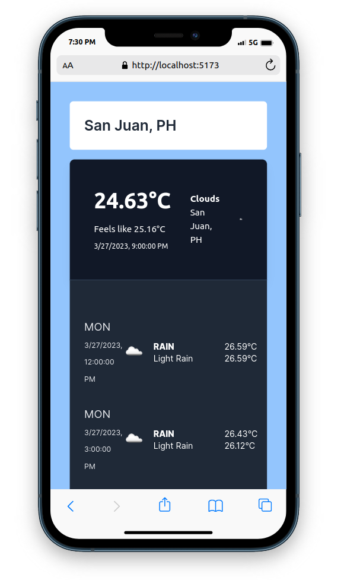
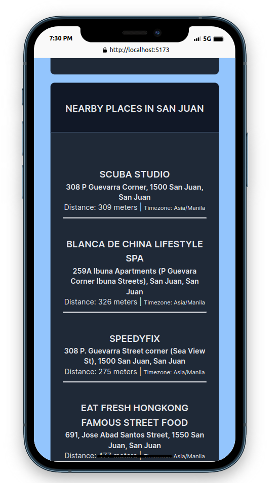
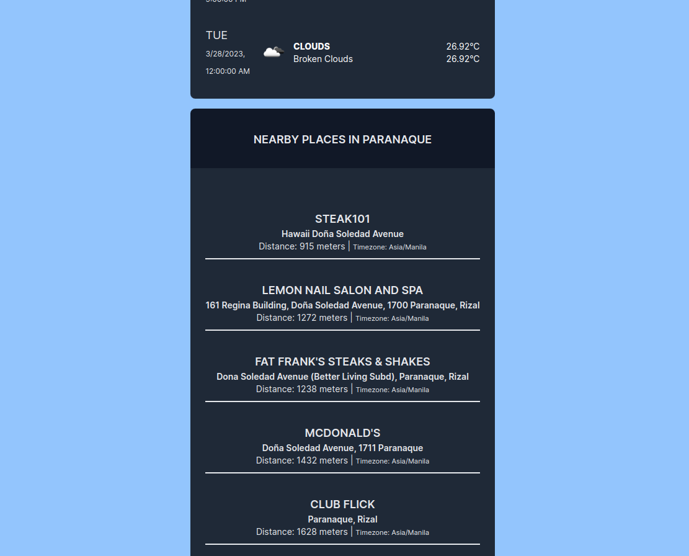

## HOW TO SETUP

1. Navigate to **backend** folder and open terminal then run the command: `composer install && npm install`

2. Make sure you have configured the `.env` file on your local project copy and its database. To do this try running `cp .env.example .env` to have a copy of the environment configuration, the API keys are already pre-installed on the `.env.example` file.

3. Run `php artisan key:generate`.

4. Navigate to **frontend** folder and open terminal then run the command: `npm install`

## HOW TO RUN

1. Navigate to **backend** folder and open terminal then run the command: `php artisan serve`. This should boot up your local server for the back-end.

2. Navigate to **frontend** folder and open terminal then run the command: `npm run dev`. This should boot up your local server for the front-end which is **http://localhost:5173/**

# Mobile Display:
#Weather Information

# Nearby Places Information

## Desktop Display:

# Weather Information

# Nearby Places Information

# Advantages on this approach.
1. It separates the functionalities between the server responsibilities of rendering data and the view or front-end responsibilies.

2. Modifications and maintenance would be a breeze for server and client projects since it is separated.

3. Mobile responsive and intuitive to use.

4. All the third party API services related functionalities are programmed at the back-end side only which is an advantage of a micro-service architecture which isolates the features and responsibilities of each services.
